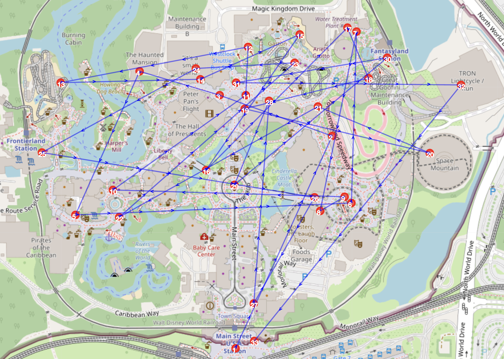
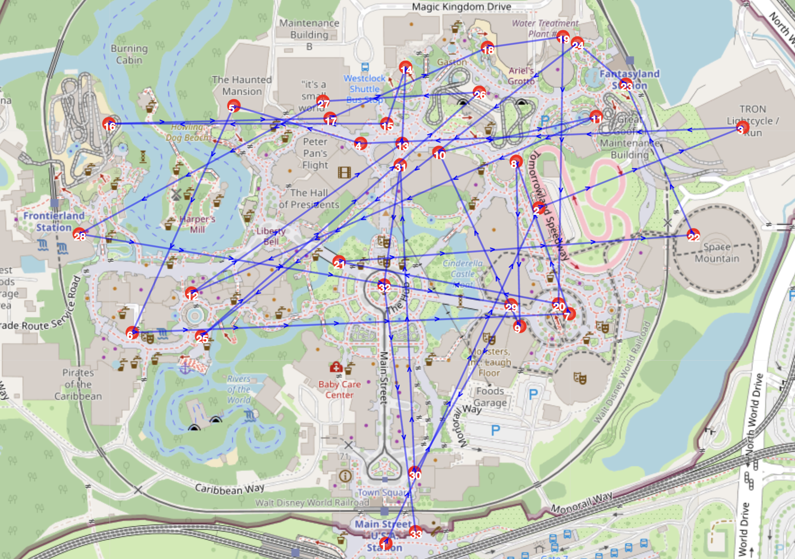
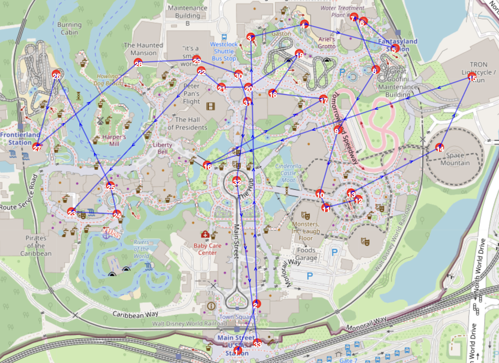

# One Day in Disneyland Magic Kingdom
**By: Yiheng Su**

## 📖 Overview

Disneyland Magic Kingdom (Orlando, FL) offers a variety of rides and attractions, but long wait times and occasional closures can make it difficult to fully enjoy the park in just one day. This project tackles the problem of planning an optimal one-day itinerary using optimization models.

### Goals:
1. **Maximize the number of attractions visited.**
2. **Minimizing the leaving time.**
3. **Minimizing the travelling time.**
4. **Maximize personal ratings for rides and attractions.**

This project is inspired by the Traveling Salesman Problem (TSP) and incorporates dynamic factors like ride availability and wait times.

---

## 📊 Data and Methods
The project uses:
- **Wait Time Data**: Collected from historical and real-time APIs.
- **Travel Times**: Based on the park layout and distances between attractions.
- **Optimization Models**: Built with integer programming to calculate efficient itineraries.

---

## 📂 Repository Structure
- `notebooks/`: Contains Jupyter Notebooks for the project.
- `data/`: Includes datasets like ride wait times and park maps.
- `images/`: Stores visualizations and example itineraries.
- `README.md`: Project overview and setup instructions.
- `requirements.txt`: List of Python dependencies.

---

## 📦 Requirements

To run this project, you need the following Python packages and tools installed:

### Python Packages
Install the required packages using the following command:
```
pip install -r requirements.txt
```

### Additional Setup
1. Install the GAMSpy library. Refer to the [GAMSpy documentation](https://gamspy.readthedocs.io/en/latest/) for instructions.

2. Install the [Gurobi Solver](https://www.gurobi.com/downloads/). Ensure you have a valid license.
```
gamspy install solver gurobi
```

---

## 📈 Results
The optimization models generated several possible schedules for a one-day visit to Disneyland Magic Kingdom, each focusing on different objectives:

### **1. Maximizing the Number of Rides Played**


This schedule prioritizes visiting as many attractions as possible within the day, sacrificing some efficiency in terms of walking and waiting times.

---

### **2. Minimizing the End Time**


This schedule is designed to ensure that the day ends as early as possible while still covering key attractions, ideal for those who prefer shorter days.

---

### **3. Maximizing the Start Time**


This schedule delays the start of the day to a more reasonable hour, focusing on attractions available later in the day.

---

### **4. Minimizing Travel Time**


After comparing these objectives, the most reasonable playing schedule was the one generated in **Section 3.3**, which focuses on **minimizing travel time**. This approach balances visiting all attractions, managing reasonable arrival and departure times, and reducing unnecessary walking.

---

### Key Outcomes:
1. **Efficient Timing**: The travel time-focused schedule avoids extremely early arrivals (e.g., 7:30 AM) and allows for a reasonable departure time around 10:00 PM.
2. **Comprehensive Experience**: All rides and attractions are included, ensuring a fulfilling and enjoyable visit.
3. **Minimized Walking**: By reducing back-and-forth movement between rides, the schedule provides a less tiring experience.

This optimized itinerary demonstrates the value of thoughtful planning in enhancing a one-day visit to Disneyland, balancing efficiency, and enjoyment. 

---

## 🚀 Usage
1. Clone the repository:
   ```
   git clone https://github.com/ysu24/Disneyland-One-Day-Schedule.git
   ```
